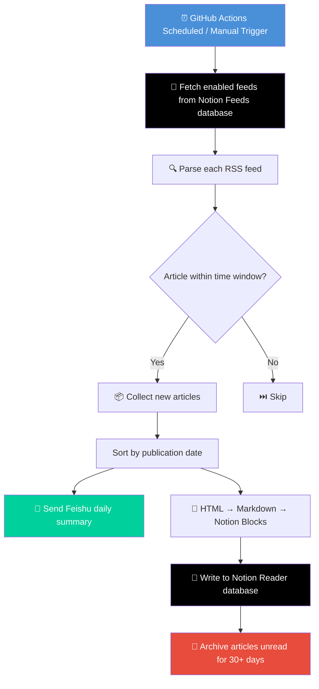

<div align="center">

# 📡 Notion RSS

**A personal RSS reader powered by Notion with Feishu notifications**

[](https://www.python.org/)
[](https://developers.notion.com/)
[](https://github.com/features/actions)
[](https://www.feishu.cn/)

Automatically fetch RSS feeds, store articles in Notion databases, and push daily summaries to Feishu groups.

[中文说明](README.zh.md)

</div>

---

## ✨ Features

- **📋 RSS Subscription Management** — Manage all feeds in Notion, enable/disable with a single checkbox
- **🔄 Automatic Fetching & Filtering** — Scheduled RSS parsing, retrieve only new articles within time window (default 24h)
- **📝 Smart Content Conversion** — HTML → Markdown → Notion Blocks, fully preserves titles, lists, links, etc.
- **📖 Notion Reader** — Articles automatically saved to Reader database, read anytime, anywhere
- **🔔 Feishu Notifications** — Daily summaries pushed to Feishu groups, never miss updates
- **🧹 Auto Cleanup** — Automatically archive unread articles older than 30 days, keep database organized
- **⚙️ GitHub Actions** — Runs daily on schedule, zero maintenance required

---

## 🔄 Workflow



---

## 📁 Project Structure

```
notion-rss/
├── main.py              # Entry point, orchestrates workflow
├── feed.py              # RSS fetching & filtering logic
├── notion.py            # Notion API interactions (read feeds, write articles, cleanup)
├── parser.py            # Content conversion (HTML → Markdown → Notion Blocks)
├── feishu.py            # Feishu webhook notifications
├── helpers.py           # Utility functions (time calculations)
├── requirements.txt     # Python dependencies
├── .env.example         # Environment variables template
└── .github/workflows/
    └── feed.yml         # GitHub Actions workflow configuration
```

---

## 🚀 Quick Start

### Prerequisites

- Python 3.12+
- Notion account + [Integration Token](https://www.notion.so/my-integrations)
- Feishu group bot webhook URL

### 1. Configure Notion Databases

Create two databases in Notion and link them to your Integration.

**Feeds Database** (manage subscriptions):

| Property | Type | Description |
|----------|------|-------------|
| `Title` | Title | Feed name |
| `Link` | URL | RSS feed URL |
| `Enabled` | Checkbox | Enable/disable this feed |

**Reader Database** (store articles):

| Property | Type | Description |
|----------|------|-------------|
| `Title` | Title | Article title |
| `Link` | URL | Article source link |
| `Created At` | Created time | Auto-generated timestamp |
| `Read` | Checkbox | Read status |

### 2. Set Environment Variables

```bash
cp .env.example .env
```

Edit `.env` with your configuration:

```env
NOTION_API_TOKEN=your_notion_api_token_here
NOTION_READER_DATABASE_ID=your_reader_database_id_here
NOTION_FEEDS_DATABASE_ID=your_feeds_database_id_here
FEISHU_WEBHOOK_URL=https://www.feishu.cn/flow/api/trigger-webhook/xxxx
RUN_FREQUENCY=86400
```

### 3. Run Locally

```bash
# Install dependencies
pip install -r requirements.txt

# Run
python main.py
```

---

## 🤖 Deploy with GitHub Actions

The project is pre-configured to run daily at UTC 5:12 (Beijing time 13:12).

### Setup Steps

1. Fork this repository
2. Go to **Settings → Secrets and variables → Actions**
3. Add the following secrets:

| Secret Name | Description |
|------------|-------------|
| `NOTION_API_TOKEN` | Notion Integration Token |
| `NOTION_READER_DATABASE_ID` | Reader database ID |
| `NOTION_FEEDS_DATABASE_ID` | Feeds database ID |
| `FEISHU_WEBHOOK_URL` | Feishu webhook URL |

4. The workflow runs automatically on schedule, or manually trigger from **Actions** tab

---

## 📋 Environment Variables

| Variable | Required | Default | Description |
|----------|----------|---------|-------------|
| `NOTION_API_TOKEN` | ✅ | — | Notion API authentication token |
| `NOTION_READER_DATABASE_ID` | ✅ | — | Reader database ID for storing articles |
| `NOTION_FEEDS_DATABASE_ID` | ✅ | — | Feeds database ID for managing subscriptions |
| `FEISHU_WEBHOOK_URL` | ✅ | — | Feishu bot webhook URL |
| `RUN_FREQUENCY` | ❌ | `86400` | Fetch time window in seconds (default 24h) |
| `CI` | ❌ | — | CI environment flag, affects log level |

---

## 🛠️ Tech Stack

| Dependency | Purpose |
|-----------|---------|
| [feedparser](https://feedparser.readthedocs.io/) | RSS/Atom feed parsing |
| [requests](https://requests.readthedocs.io/) | HTTP requests (Notion API, Feishu webhook) |
| [markdownify](https://github.com/matthewwithanm/python-markdownify) | HTML to Markdown conversion |
| [python-dotenv](https://github.com/theskumar/python-dotenv) | Environment variables management |

---

## 📝 License

MIT

## 🤝 Contributing

Contributions are welcome! Feel free to submit issues and pull requests.
